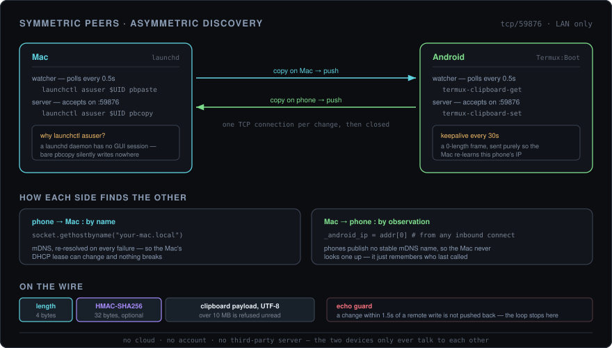

<div align="center">

# clipsyncd

**Copy on your Mac, paste on your phone. And the other way round.**

Two small daemons, one LAN port, no cloud account and no third-party server anywhere in the path.

<p>
  
  
  
  
  
</p>

<br />



<sub>Both sides run the same loop. Only the way they find each other differs — and that difference is the whole design.</sub>

</div>

<br />

---

## The short version

Clipboard sync usually means an account, a server in someone else's datacentre, and your passwords making a round trip through it. This is 326 lines of standard-library Python that keeps the whole exchange on your own network: one device opens a TCP connection to the other, hands over the bytes, and closes it.

Copy a URL on your laptop, paste it on your phone a half-second later. Copy an OTP on your phone, paste it on your laptop. That's the feature.

It survives the things that actually break this kind of tool: your Mac's IP changing, your phone rebooting, a VPN switching on, the terminal window being closed.

---

## What it handles

| Situation | What happens |
|---|---|
| Copy on Mac | On the phone's clipboard within ~0.5s |
| Copy on Android | On the Mac's clipboard within ~0.5s |
| Mac's IP changes | The phone re-resolves it over mDNS on the next failure |
| Phone's IP changes | The Mac relearns it from the next inbound connection — at worst 30s |
| Phone reboots | Termux:Boot restarts the daemon |
| Mac reboots | `launchd` restarts the daemon, and the phone's keepalive re-announces itself |
| Terminal closed | Irrelevant — both run detached |
| VPN switched on | Still works; LAN traffic doesn't enter the tunnel |
| Same text copied twice | No push — nothing changed |

---

## How it works

Both sides run the identical structure: a watcher thread polling the clipboard every 0.5s, and a server thread accepting on port `59876`. When the local clipboard changes, it opens a connection, writes one length-prefixed frame, and closes. No persistent connection, no session state.

The interesting part is discovery, and it isn't symmetric.

**The phone finds the Mac by name.** `your-mac.local` resolves over mDNS, which every Mac publishes for free. It's re-resolved on every failure, so a new DHCP lease costs one retry rather than a config edit.

**The Mac never looks up the phone.** It can't — Android publishes no stable mDNS name. Instead it remembers the address of whoever last connected to it. That is the real reason the phone sends a zero-length keepalive frame every 30 seconds: not to prove liveness, but to keep the Mac's idea of "where the phone is" fresh, so the first Mac→phone push after a reboot doesn't disappear into a stale address.

**`pbcopy` does not behave the way you'd expect from a daemon.** A `launchd` agent runs outside the GUI session, and plain `pbcopy` there writes to a pasteboard nobody can see — silently, with exit status 0. Every clipboard call on the Mac side goes through `launchctl asuser $UID` so it lands in the real session. That one detail is the difference between "works when I run it in Terminal" and "works".

**Echo suppression is a timestamp, not a flag.** After a remote write, local changes are ignored for 1.5 seconds. Without it the Mac's own write trips the Mac's watcher, which pushes back to the phone, which trips the phone's watcher — and the same string bounces between the two devices indefinitely.

---

## Setting it up

### 1. Pick a shared secret

Optional, but do it. Without one, anything on your LAN can write into your clipboard.

```zsh
python3 -c "import secrets; print(secrets.token_hex(32))"
```

The same value goes in the environment on **both** devices as `CLIPSYNCD_SECRET`. When it's set, every frame carries an HMAC-SHA256 tag and unverified frames are dropped. When it isn't, the daemon runs in plaintext and says so in the log.

### 2. Mac

```zsh
sudo cp clipsyncd_mac.py /usr/local/bin/clipsyncd.py
sudo chmod 755 /usr/local/bin/clipsyncd.py
```

Create `~/Library/LaunchAgents/com.user.clipsyncd.plist`:

```xml
<?xml version="1.0" encoding="UTF-8"?>
<!DOCTYPE plist PUBLIC "-//Apple//DTD PLIST 1.0//EN" "http://www.apple.com/DTDs/PropertyList-1.0.dtd">
<plist version="1.0">
<dict>
    <key>Label</key>
    <string>com.user.clipsyncd</string>
    <key>ProgramArguments</key>
    <array>
        <string>/usr/bin/python3</string>
        <string>/usr/local/bin/clipsyncd.py</string>
    </array>
    <key>EnvironmentVariables</key>
    <dict>
        <key>CLIPSYNCD_SECRET</key>
        <string>PASTE_YOUR_SECRET_HERE</string>
    </dict>
    <key>RunAtLoad</key><true/>
    <key>KeepAlive</key><true/>
    <key>StandardOutPath</key><string>/tmp/clipsyncd.log</string>
    <key>StandardErrorPath</key><string>/tmp/clipsyncd.log</string>
</dict>
</plist>
```

```zsh
launchctl bootstrap gui/$(id -u) ~/Library/LaunchAgents/com.user.clipsyncd.plist
hostname     # note this down — the phone needs it
```

### 3. Android

Termux, Termux:API, and Termux:Boot, **from F-Droid**. The Play Store builds are frozen on an old version and are missing what this needs.

[Termux](https://f-droid.org/repo/com.termux_118.apk) · [Termux:API](https://f-droid.org/repo/com.termux.api_51.apk) · [Termux:Boot](https://f-droid.org/repo/com.termux.boot_7.apk)

```bash
pkg install termux-api python
cp clipsyncd_android.py ~/clipsyncd.py
```

Point it at your Mac and hand it the secret — no editing the script:

```bash
cat >> ~/.bashrc << 'EOF'
export CLIPSYNCD_MAC_HOSTNAME="your-mac-hostname.local"
export CLIPSYNCD_SECRET="PASTE_YOUR_SECRET_HERE"
EOF
source ~/.bashrc
```

Then make it survive a reboot:

```bash
mkdir -p ~/.termux/boot
cat > ~/.termux/boot/clipsyncd.sh << 'EOF'
#!/data/data/com.termux/files/usr/bin/bash
termux-wake-lock
export CLIPSYNCD_MAC_HOSTNAME="your-mac-hostname.local"
export CLIPSYNCD_SECRET="PASTE_YOUR_SECRET_HERE"
nohup python3 ~/clipsyncd.py > ~/clipsyncd.log 2>&1 &
EOF
chmod +x ~/.termux/boot/clipsyncd.sh
```

Open the Termux:Boot app once to arm it, then set **Settings → Apps → Termux → Battery → Unrestricted**. Skip that last step and Android will quietly kill the daemon after a few hours.

---

## Configuration

Everything is an environment variable, read by both sides at startup.

| Variable | Default | Meaning |
|---|---|---|
| `CLIPSYNCD_SECRET` | unset | Shared HMAC key. Unset means plaintext, plus a warning in the log |
| `CLIPSYNCD_MAC_HOSTNAME` | `your-mac-hostname.local` | Android side only — the Mac's mDNS name |

Constants at the top of either script, if you want to tune them: `PORT` (59876), `POLL_INTERVAL` (0.5s), `REMOTE_SET_COOLDOWN` (1.5s), `KEEPALIVE_INTERVAL` (30s), `MAX_MESSAGE_BYTES` (10 MB).

---

## Day to day

```zsh
# Mac
launchctl list | grep clipsyncd
tail -f /tmp/clipsyncd.log
launchctl kickstart -k gui/$(id -u)/com.user.clipsyncd
```

```bash
# Android
pgrep -f clipsyncd.py && echo running || echo stopped
tail -f ~/clipsyncd.log
pkill -f clipsyncd.py && nohup python3 ~/clipsyncd.py > ~/clipsyncd.log 2>&1 &
```

---

## When it misbehaves

| Symptom | Cause |
|---|---|
| Stops after a few hours on Android | Battery optimisation. Termux → Battery → Unrestricted |
| Mac never receives anything | `sudo lsof -i :59876` — if nothing is listening the agent didn't start. Check `/tmp/clipsyncd.log` |
| Phone can't resolve the Mac | Different networks, or guest Wi-Fi with client isolation. Try `ping your-mac.local` from Termux |
| `HMAC verification failed` in the log | The two secrets differ. They have to match exactly |
| Fine on Wi-Fi, dead on VPN | Add Termux to the VPN's split-tunnel bypass list |
| Text ping-pongs between devices | Raise `REMOTE_SET_COOLDOWN` — a slow clipboard write can outlast 1.5s |

---

## Scope, honestly

**Text only.** `pbpaste` and `termux-clipboard-get` both deal in strings. Images and files aren't synced.

**Authenticated, not encrypted.** With a secret set, the HMAC stops a stranger on your Wi-Fi from injecting into your clipboard. It does not hide anything: payloads travel in the clear, and anyone capturing traffic on that network can read them. Don't run it somewhere that matters.

**Two devices.** The Mac tracks exactly one phone address — the last one that connected.

**No queue.** If the other device is asleep, that copy is simply missed. The next one syncs.

---

## Cost

| Resource | Usage |
|---|---|
| CPU | Effectively zero — sleeping 0.5s at a time |
| RAM | ~15 MB per side |
| Battery | Negligible: no GPS, no radio wakeups of its own, plain TCP |
| Network | LAN only, peer to peer, one short connection per copy |

---

## Contributors

| | |
|---|---|
| [chakri192](https://github.com/chakri192) | Author |
| [aider](https://github.com/Aider-AI/aider) | AI pair programmer |
