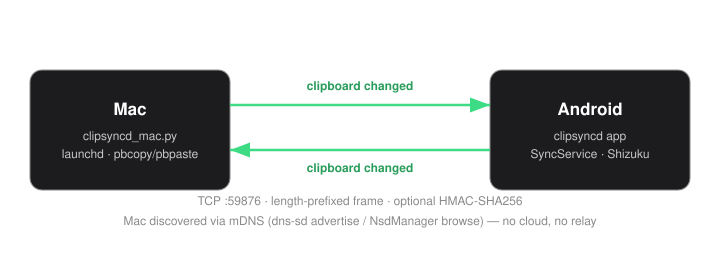
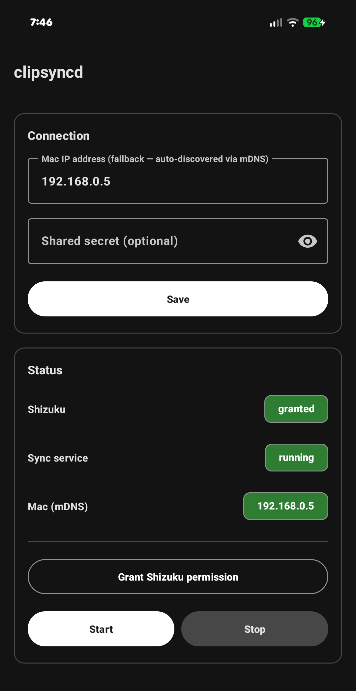

<div align="center">

# clipsyncd

**Bidirectional clipboard synchronisation between macOS and Android over a local network.**

Two daemons, one TCP port, and no cloud service, account, or third-party server in the path.

<p>
  
  
  
  
</p>



</div>

---

## Overview

Clipboard sync usually means an account, and your data routing through someone else's server. clipsyncd doesn't. One device opens a TCP connection to the other, sends one small message, and closes it. That's the whole transport.

Copy a URL on the laptop, paste it on the phone half a second later. Copy a one-time code on the phone, paste it on the laptop. Nothing else changes hands.

There are two pieces:

| Side | What it is | Size |
|---|---|---|
| macOS | `clipsyncd_mac.py`, a standard-library daemon | 156 lines |
| Android | `android-app/`, a native Kotlin app | — |

The Android side used to be a Termux script. It got rewritten as a real app because Termux turned out to be fundamentally incompatible with how Android protects the clipboard — the [Architecture](#architecture) section below explains why.

**What to expect day to day:**

| Condition | Behaviour |
|---|---|
| Copy on either device | Available on the other in ~0.5s |
| Mac's IP address changes | Phone rediscovers it via mDNS automatically |
| Phone's IP address changes | Mac relearns it from the next inbound connection (≤30s) |
| Mac reboots | `launchd` restarts the daemon; it re-advertises itself |
| Phone reboots | Sync service restarts automatically; Shizuku needs one tap to restart |
| Both devices move to a new network together (new Wi-Fi, a phone hotspot) | Works unmodified |
| Devices end up on *different* networks | Does not work — see [Limitations](#limitations) |
| A VPN is active on either device | Usually breaks sync (most VPNs tunnel LAN traffic by default) |
| Identical text copied twice | Nothing sent; nothing changed |

## Requirements

| Platform | Needs |
|---|---|
| macOS | Python 3 (the system interpreter is enough) |
| Android | [Shizuku](https://github.com/RikkaApps/Shizuku), installed and paired once. No root. |

## Installation

### 1. Generate a shared secret

Optional, but recommended — without it, any host on the local network can write to your clipboard.

```sh
python3 -c "import secrets; print(secrets.token_hex(32))"
```

Set the result as `CLIPSYNCD_SECRET` on both devices. When it's present, every message carries an HMAC-SHA256 tag, and anything unverified gets dropped silently.

### 2. macOS

```sh
sudo cp clipsyncd_mac.py /usr/local/bin/clipsyncd.py
sudo chmod 755 /usr/local/bin/clipsyncd.py
```

Create `~/Library/LaunchAgents/com.user.clipsyncd.plist` with `RunAtLoad` and `KeepAlive` enabled, and an `EnvironmentVariables` dictionary carrying the secret. Then load it:

```sh
launchctl bootstrap gui/$(id -u) ~/Library/LaunchAgents/com.user.clipsyncd.plist
```

### 3. Android

**Step one — install and pair Shizuku**, from its [GitHub releases](https://github.com/RikkaApps/Shizuku/releases) or F-Droid:

1. Settings → Developer options → enable **Wireless debugging**.
2. Open Shizuku → **Start via Wireless debugging** → **Pairing** → follow the on-device flow.
3. Tap **Start**. Shizuku now stays pairable across reboots — no computer needed again, just reopen the app and tap Start.
4. Leave the permission prompt for step 6 below.

**Step two — build and install the app.** Needs the Android SDK; command-line tools are enough, Android Studio isn't required.

```sh
cd android-app
sdkmanager "platform-tools" "platforms;android-35" "build-tools;35.0.0"
gradle assembleDebug
adb install -r app/build/outputs/apk/debug/app-debug.apk
```

**Step three — configure it in-app:**

5. Enter the shared secret, tap **Save**. Leave the Mac IP field blank — mDNS finds it automatically (see [Architecture](#architecture)); that field only matters as a fallback.
6. Tap **Grant Shizuku permission**, allow it.
7. Tap **Start sync service**.
8. Set both **clipsyncd** and **Shizuku** to unrestricted battery: Settings → Apps → *(app)* → Battery → Unrestricted. Skipping this reintroduces the exact reliability problem that motivated building a native app in the first place.

<div align="center">

</div>

A working setup looks like the screenshot above — three green chips.

## Architecture

Both sides run the same shape: something watching the clipboard, and a server on port `59876`. On a local change, the watcher opens a connection, writes one length-prefixed frame, and closes it. No persistent connection, no session state.

The two sides don't reach the clipboard the same way, though:

| | macOS | Android |
|---|---|---|
| Read clipboard | `pbpaste` via `launchctl asuser` | Shizuku-brokered `IClipboard.getPrimaryClip` |
| Write clipboard | `pbcopy` via `launchctl asuser` | Plain `ClipboardManager.setPrimaryClip` |
| Detect local changes | Poll every 0.5s | Poll every 0.5s |
| Find the peer | Waits for an inbound connection | `NsdManager` browses for the Mac's Bonjour service |
| Advertise itself | `dns-sd -R` at startup | — (Android has no stable mDNS name) |

A few of those rows need explaining.

**Why Android needs Shizuku.** Since Android 10, `ClipboardManager.getPrimaryClip()` only returns data to whichever app currently has focus, or the default keyboard. Everything else gets nothing back.

This was confirmed directly, not assumed: the original Termux daemon could read the clipboard while Termux was on-screen, and got nothing every single time it was polled from the background. No background daemon can read a clipboard change made in another app under this restriction — Termux-based or otherwise.

So a background daemon needs a different way in:

- **Shizuku** runs calls with adb-shell-level privilege — a level this focus check simply doesn't apply to.
- `IClipboard` is a hidden, non-SDK interface. Reflecting into it needs its own [hidden-API exemption](https://github.com/LSPosed/AndroidHiddenApiBypass).
- The normal event-driven API (`OnPrimaryClipChangedListener`) doesn't fire in the background either — which is why the app polls, the same as the Mac side polls `pbpaste`.

**Why discovery is asymmetric.** The phone finds the Mac through real mDNS *service* discovery, not hostname resolution:

- `clipsyncd_mac.py` advertises `_clipsyncd._tcp` over Bonjour at startup.
- `NsdHelper.kt` browses for that service and resolves a live IP and port, one that updates automatically as the network changes.

Plain hostname resolution (`your-mac.local`) was tried first, and doesn't work on stock Android — there's no `nss-mdns` equivalent in the platform's resolver. Confirmed directly: both `socket.gethostbyname` and `InetAddress.getByName` fail the same way.

The Mac doesn't return the favor, because Android has no stable mDNS name of its own to advertise. Instead, the Mac just remembers whoever connected most recently. The phone's 30-second empty keepalive exists to keep that memory current — not to prove it's alive, but so a Mac reboot doesn't leave it pointing at a stale address.

**Echo suppression uses a timestamp, not a flag.** For 1.5 seconds after a remote write, local changes are ignored. Skip this, and a write triggers the local watcher, which sends it back to where it came from, which triggers *that* watcher — and the value circulates forever. Both sides handle this the same way.

## Configuration

The Mac daemon reads its configuration from the environment:

| Variable | Default | Description |
|---|---|---|
| `CLIPSYNCD_SECRET` | unset | Shared HMAC key. If unset, the daemon runs in plaintext and logs a warning. |

Other constants live at the top of `clipsyncd_mac.py`:

| Constant | Value |
|---|---|
| `PORT` | 59876 |
| `POLL_INTERVAL` | 0.5s |
| `REMOTE_SET_COOLDOWN` | 1.5s |
| `MAX_MESSAGE_BYTES` | 10 MB |
| `BONJOUR_SERVICE_TYPE` / `BONJOUR_NAME` | mDNS advertisement identity |

The Android app's equivalents live in `Protocol.kt`. Its Mac-IP and secret are entered in-app (`SharedPreferences`), not read from the environment — and the IP field is an optional fallback, not required input, since `NsdHelper.kt` finds the Mac on its own.

## Operation

```sh
# macOS
launchctl list | grep clipsyncd
tail -f /tmp/clipsyncd.log
launchctl kickstart -k gui/$(id -u)/com.user.clipsyncd
```

```sh
# Android
adb logcat -s ClipsyncdService:* ShizukuClipboard:*
```

Or just look at the app — the status card shows color-coded chips for Shizuku, the sync service, and mDNS discovery, the same screenshot as above.

**About the Android notification:** Android requires a visible notification for any continuously-running background service — that's a platform rule, not an app setting, and there's no way around it while the service keeps running. It's trimmed to the minimum allowed: one line, no timestamp, `IMPORTANCE_MIN` (which also suppresses its status bar icon entirely), sitting in the notification shade's collapsed "Silent" section.

## Troubleshooting

| Symptom | Cause |
|---|---|
| Android→Mac stops after a phone reboot | Shizuku needs a manual "Start" tap after every reboot — open Shizuku, tap Start |
| Mac receives nothing from phone | `sudo lsof -i :59876` on the Mac — no listener means the daemon failed to start. On the phone, check Shizuku shows "running" and the app shows "permission granted" |
| `readText failed` in Android logs | Shizuku isn't running, or its permission wasn't granted |
| App shows "mDNS: not discovered" indefinitely | Run `dns-sd -B _clipsyncd._tcp local.` from another machine on the same network. If it finds nothing, the Mac's advertisement isn't running (check its log for "advertising … via Bonjour"). If it does find it but the phone still can't, the network is likely blocking multicast — enter the Mac's IP manually as a fallback |
| Phone cannot reach the Mac at all | Different networks, or a guest Wi-Fi with client isolation — this breaks mDNS and the manual-IP fallback equally |
| `HMAC verification failed` in the log | The configured secrets differ between devices |
| Values circulate between devices | Increase `REMOTE_SET_COOLDOWN` / `Protocol.REMOTE_SET_COOLDOWN_MS` |

## Limitations

**Text only.** `pbpaste` and the Android clipboard API both operate on strings. Images and files aren't synchronised.

**Authenticated, not encrypted.** The HMAC stops an unauthorised host from injecting into your clipboard. It doesn't provide confidentiality — payloads are cleartext, readable by anyone capturing traffic on that network.

**Two devices.** The Mac tracks one phone address: whichever connected most recently.

**No queue.** If the peer is unreachable, that one clipboard entry is lost. The next change syncs normally.

**Shizuku, no root.** The Android side needs Shizuku running, plus one manual restart after each phone reboot. That's the cost of working around Android's background-clipboard restriction without root or turning clipsyncd into the device's keyboard — both worse tradeoffs.

**Same network only, by design.** Everything here — TCP connections, mDNS discovery — is LAN-only, on purpose, to keep the "no cloud, no third party" promise in the first line of this README.

If the Mac and phone are on different networks (different Wi-Fi, phone on mobile data, either one behind a tunneling VPN), sync doesn't work, and there's no fallback that fixes it without reintroducing the kind of dependency this project avoids — a VPN mesh like Tailscale (what the very first version of this project actually used), or forwarding the Mac's port onto the public internet.

A phone hotspot is the one exception that still works: the Mac joining it puts both devices back on one real local network.

**Auto-discovery needs multicast.** Some networks — enterprise Wi-Fi, some guest networks — filter multicast by policy, even when both devices are otherwise on the same network. The manual-IP fallback covers this case.

## Resource usage

| Resource | Usage |
|---|---|
| CPU | Negligible — sleeps between 0.5s polls |
| Memory | ~15 MB per device |
| Battery | Minimal — no GPS, no independent radio wakeups |
| Network | LAN only, peer to peer, one short-lived connection per change |

## Contributors

| | |
|---|---|
| [chakri192](https://github.com/chakri192) | Author |
| [aider](https://github.com/Aider-AI/aider) | AI pair programmer |
